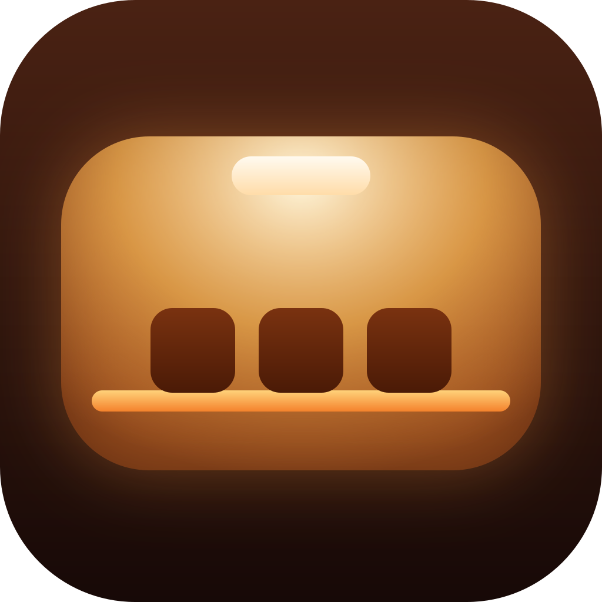
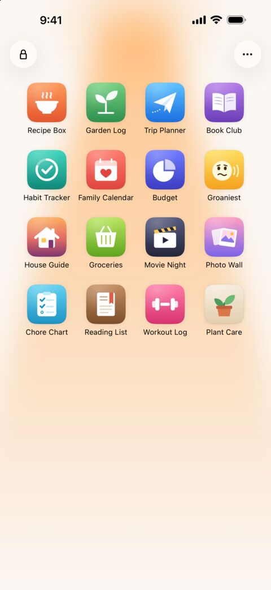
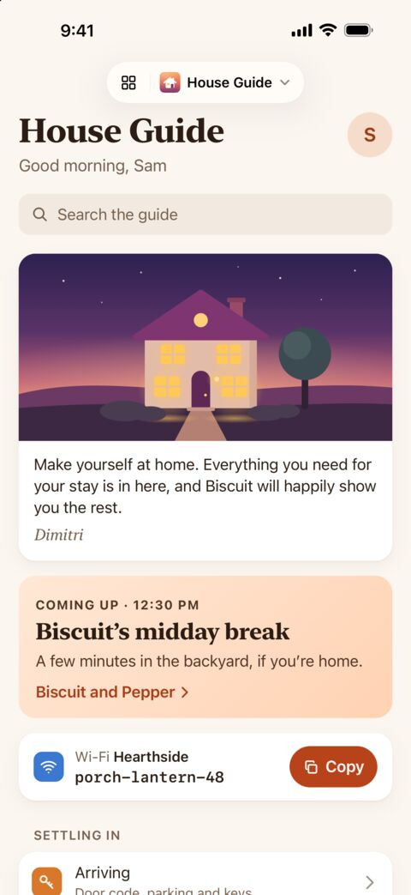
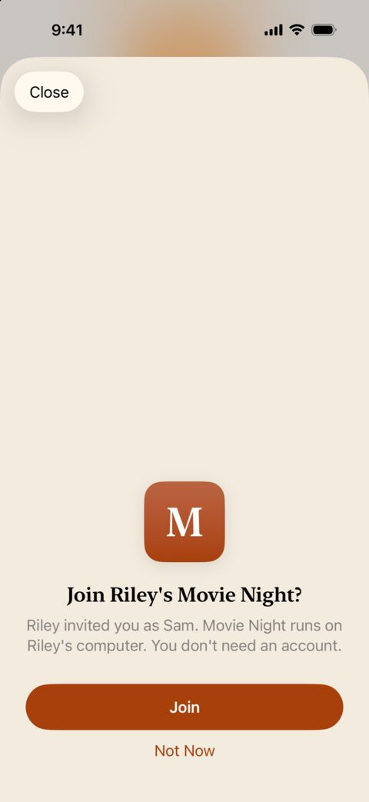

<p align="center">
  
</p>

<h1 align="center">Ovenlight</h1>

<p align="center">
  The web apps you run on your own computer, on your iPhone behind Face&nbsp;ID.<br>
  Share one with a friend without sharing the computer it runs on.
</p>

<p align="center">
  <a href="https://apps.apple.com/app/id6817561066">App Store</a> ·
  <a href="#get-started">Get started</a> ·
  <a href="#build-apps-for-ovenlight">Build an app</a> ·
  <a href="https://ovenlight.app">ovenlight.app</a>
</p>

<p align="center">
  <picture>
    <source media="(prefers-color-scheme: dark)" srcset="site/images/launcher-dark-480.jpg">
    
  </picture>&nbsp;
  <picture>
    <source media="(prefers-color-scheme: dark)" srcset="site/images/house-guide-dark-480.jpg">
    
  </picture>&nbsp;
  <picture>
    <source media="(prefers-color-scheme: dark)" srcset="site/images/join-dark-480.jpg">
    
  </picture>
</p>

Ovenlight is an iPhone launcher for the small web apps you run on your own computers: the
recipe box, chore chart or trip planner you built for your family, maybe with a coding
agent over a weekend. It reaches them over your own Tailscale network (your tailnet)
through a Tailscale node built into the iPhone app, so the phone needs no VPN and no
Tailscale app. One Face ID unlock opens all of them, and each one runs full screen from
its own icon, with its storage kept apart from the others.

To share an app, send a friend an invite link. They install Ovenlight, open the link and
tap Join, with no account to create.

Ovenlight is free, and so is the connector that runs on your computer. It's made by
Dimitri Cole at [Snowy Ghost](https://snowyghost.com).

## How it works

There are two parts:

- **The connector** (the `ovenlight` command, in [`connector/`](connector)) runs on the
  computer with your apps. It makes each app a device in your tailnet, with an HTTPS
  address, and passes each request on to the app at `127.0.0.1` with headers that say who
  is calling. It also manages your guests.
- **The iPhone app** (in [`Ovenlight/`](Ovenlight)) joins your tailnet, finds the apps you
  publish and opens them.

When you share an app, your friend's iPhone joins your tailnet as a guest device that can
reach only the apps you invited them to, and none of your other devices. Phones reach your
computer over your tailnet, never through servers of ours. Ovenlight has no account of its
own, no analytics and no ads.

## What you need

- An iPhone with iOS 18.1 or later, and Ovenlight from the
  [App Store](https://apps.apple.com/app/id6817561066). To build the app yourself, see
  [docs/development.md](docs/development.md#the-iphone-app).
- A computer that stays on and awake while anyone uses your apps: a Mac with macOS 13 or
  later, logged in to its desktop; a Linux computer with systemd, such as Ubuntu; or a
  Windows 11 PC.
- A Tailscale account. Its free Personal plan is for non-commercial use, so a business
  needs one of [Tailscale's paid plans](https://tailscale.com/pricing). The computer
  doesn't need the Tailscale app. Headscale is supported for
  [development](docs/development.md#local-headscale) only.

[docs/connector.md](docs/connector.md#what-the-computer-needs) says how the connector runs
on each system, including on a Mac without a display.

## Get started

### 1. Turn on HTTPS certificates

In the Tailscale admin console, under [DNS](https://console.tailscale.com/admin/dns), turn
on MagicDNS if it's off, then turn on HTTPS certificates. Each app gets its own HTTPS
address in your tailnet, and Ovenlight opens apps only over HTTPS.

### 2. Install the connector

On a Mac, in Terminal:

```sh
mkdir -p ~/ovenlight-connector && cd ~/ovenlight-connector
curl -fsSL https://downloads.ovenlight.app/connector/latest/ovenlight-connector-macos.tar.gz |
  tar xz --strip-components 1
./install.sh
```

On Linux, use `linux-amd64` or `linux-arm64` in place of `macos`; the arm64 build is
untested on a real machine so far. On Windows,
[build the connector from source](docs/connector.md#from-source) for now.

The script installs the `ovenlight` command and keeps the connector running. When
`~/.local/bin` isn't on your `PATH`, as on a new Mac, the script prints a line for your
shell profile: add it, open a new Terminal window and run
`~/ovenlight-connector/install.sh` again, so the `ovenlight` commands below work as
written. To update later, run the same commands again; `ovenlight doctor` tells you when a
new release is out. [docs/connector.md](docs/connector.md#install) also says how to
download in a browser or check a download's signature, and where everything goes.

### 3. Publish an app

Run your app on the same computer, on a port nothing else uses. It must serve plain HTTP
on `127.0.0.1`, and serve static files only from a public folder, never from the project's
folder with its data and code. Then publish it with its port:

```sh
ovenlight publish --port 4317 --name "Recipe Box"
```

No app yet? `ovenlight new "Family List" --dir ~/src` writes a starter app and says how to
run and publish it.

Recipe Box becomes its own device in your tailnet, at
`https://recipe-box.<your-tailnet>.ts.net/`. Public certificate logs list that address, so
pick names you don't mind people seeing. For each new app, `publish` prints a login link:
open it and sign in with your Tailscale account. Once you store an API access token (see
[Share an app](#share-an-app)), later apps sign in without a login link.
`ovenlight doctor` checks the whole setup and gives a fix for anything wrong, and
`ovenlight help` lists every command.

To have the connector start your app and keep it running instead, stop your copy (Ctrl-C
in its terminal, never `pkill` by name). Then, in the app's folder, give `publish` the
command that starts it:

```sh
ovenlight publish --port 4317 --name "Recipe Box" --run 'npm start'
```

### 4. Open it on your iPhone

In Ovenlight, choose Use My Own Computers, tap Connect, and sign in with the same
Tailscale account. If you've already joined someone else's app, you'll find Use My Own
Computers in Settings, under the ••• button. If your tailnet has device approval on,
approve the iPhone and the app (listed as `recipe-box`) in the
[admin console](https://console.tailscale.com/admin/machines). Your apps then appear on
their own. If one doesn't, `ovenlight doctor` says why.

## Share an app

Your friend needs only Ovenlight, and you need an API access token from the Tailscale
admin console, under [Settings, Keys](https://console.tailscale.com/admin/settings/keys).
Store it once; `auth set` asks for it, with input hidden:

```sh
ovenlight auth set
```

Then make the app shareable:

```sh
ovenlight publish --slug recipe-box --shareable
```

It asks you to confirm the owner, then shows the exact change it will make to your tailnet
policy, and changes nothing until you type `yes`.

To invite someone:

```sh
ovenlight share recipe-box --to "Sam"
```

It prints a link, a QR code and a message to send. Sam opens the link on their iPhone and
taps Join. An invite works once and expires after 24 hours. `ovenlight guests` lists your
guests and open invites, and `ovenlight revoke Sam` removes Sam from every app
immediately; add `--app <slug>` to remove Sam from just one. You can also share from
Ovenlight on your iPhone: touch and hold one of your apps, then choose Share.

From inside the app, Sam can send you a note and a screenshot with Send Feedback, in the
app's menu. `ovenlight feedback` lists what arrives.

[docs/connector.md](docs/connector.md#share-an-app) has the details, such as token expiry
and unpublishing a shareable app, and
[docs/security.md](docs/security.md#the-policy-change) explains the policy change.

## Build apps for Ovenlight

Any web app that serves plain HTTP on `127.0.0.1` works, and it needs no login of its own:
the connector tells it who is calling with headers such as `Ovenlight-User-Id` and
`Ovenlight-Role`. A web manifest gives the app its icon and color in Ovenlight. Apps get
no service workers or offline copies, so an app loads only while its computer can be
reached ([details](docs/app-contract.md#in-the-iphone-app)).

The starter app from `ovenlight new` already suits Ovenlight.
[docs/building-apps.md](docs/building-apps.md) is the guide to building an app that feels
at home in Ovenlight, written for coding agents first; `ovenlight guide` prints it.
[docs/app-contract.md](docs/app-contract.md) is the contract itself, including what an app
must do to stay safe.

### With a coding agent

The connector is also an MCP server, so a coding agent can publish and check your apps and
read the feedback people send. To add it to Claude Code on a Mac:

```sh
claude mcp add --scope user ovenlight -- \
  ~/Library/Application\ Support/ovenlight/bin/ovenlight mcp
```

On Linux, the path is `~/.local/state/ovenlight/bin/ovenlight`. On Windows, in PowerShell:

```powershell
claude mcp add --scope user ovenlight -- "$env:LOCALAPPDATA\ovenlight\bin\ovenlight.exe" mcp
```

On a Mac, you can install Ovenlight's Claude Code plugin instead. It adds the same MCP
server and a skill that reads the guide whenever you ask to put an app on your phone. In
Claude Code, run:

```
/plugin marketplace add snowy-ghost/ovenlight
```

then:

```
/plugin install ovenlight@snowy-ghost
```

## Documentation

- [docs/connector.md](docs/connector.md): installing and updating the connector,
  publishing and sharing apps, moving to a new Mac and uninstalling.
- [docs/building-apps.md](docs/building-apps.md): building an app that works and feels
  native in Ovenlight, for coding agents and people.
- [docs/app-contract.md](docs/app-contract.md): what an app behind Ovenlight must do and
  may rely on.
- [docs/security.md](docs/security.md): the threat model, the tailnet policy change,
  logging and privacy.
- [docs/protocol.md](docs/protocol.md): how the iPhone app and the connector talk.
- [docs/development.md](docs/development.md): building the iPhone app, tests, local
  development, shipping and forking.

## Security

Every guest request passes two independent checks: your tailnet policy lets a guest's
phone reach only the apps you shared with them, and the connector looks up which device is
calling and refuses any guest you didn't invite to the app they're opening.
[docs/security.md](docs/security.md) has the threat model, and
[what to do](docs/security.md#if-something-goes-wrong) about a leaked link or credential,
a lost phone, a stolen computer or a compromised app.

To report a vulnerability, see [SECURITY.md](SECURITY.md).

## License

Snowy Ghost LLC licenses Ovenlight, this version and every earlier one, under the
[Apache License 2.0](LICENSE); see also [NOTICE](NOTICE). The iPhone app and the connector
include third-party code under their own licenses, listed in each release's
`THIRD_PARTY_NOTICES.txt` and in the app under Settings, Acknowledgements.

Snowy Ghost LLC also licenses two things under [MIT-0](https://spdx.org/licenses/MIT-0.html),
in every version, so apps built from them carry no conditions from us: the starter app
that `ovenlight new` writes (`connector/starter`), and the code samples in
[docs/building-apps.md](docs/building-apps.md), which `ovenlight guide` prints. The App
Store badge in `site/images` is Apple's artwork, used under Apple's terms.

Ovenlight and the Ovenlight icon are trademarks of Snowy Ghost LLC. The licenses above give
no right to use them except to say where the software comes from, so a changed version you
distribute needs its own name and icon. Ovenlight works with Tailscale and isn't
affiliated with Tailscale Inc.

## Contributing

Issues and bug reports are welcome. We don't accept code contributions yet, so please don't
open pull requests: describe the change you'd like in an issue.
